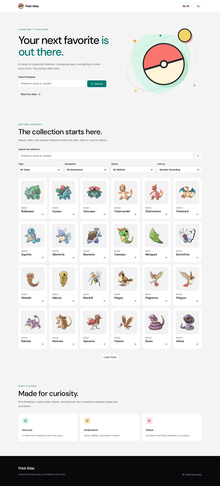
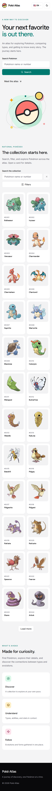
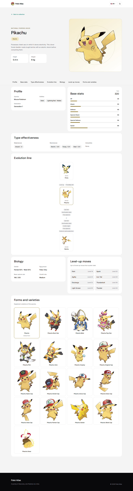

# poke-atlas

A multilingual Pokédex built with React, TypeScript, Vite, and Tailwind CSS.
Poké Atlas includes a responsive, infinitely scrolling catalog,
debounced name/number search, shareable type/generation/ability filters, sorting,
detail routes, theme and language preferences, shared UI primitives, validated
PokéAPI models, and persisted TanStack Query caching. Pokémon details show
localized flavor text, measurements, abilities, base stats, type matchups,
evolution requirements, gender ratio, egg groups, capture rate, growth rate,
species varieties, and a compact level-up move list. The detail view has
distinct light/dark themes for all 18 Pokémon types, including a secondary
accent for dual types. Automated unit, browser, and production Pages checks
cover the published version. See the [roadmap](pokedex-project-roadmap.md) for
release verification and post-MVP extensions.

**Live site:** [lucaspmm.github.io/poke-atlas](https://lucaspmm.github.io/poke-atlas/)

## Requirements

- Node.js 24
- pnpm 10.33.4

## Commands

```sh
pnpm install
pnpm dev
pnpm check
pnpm test:coverage
pnpm test:e2e
pnpm build
```

The app uses hash routes so it can run on GitHub Pages without server-side
route rewrites. To build for a project page, set `GITHUB_PAGES_BASE` to the
repository path, for example `/poke-atlas/`. Run the production smoke test
against that build:

```sh
GITHUB_PAGES_BASE=/poke-atlas/ pnpm build
GITHUB_PAGES_BASE=/poke-atlas/ pnpm test:pages
```

The [deployment workflow](.github/workflows/deploy.yml) runs checks, coverage,
desktop/mobile browser journeys, and the production smoke test before
publishing the `dist` artifact from `main`. The [first successful Pages
deployment](https://github.com/LucasPMM/poke-atlas/actions/runs/34792164195)
published commit `c683235`.

## Screenshots

### Desktop catalog



### Mobile catalog



### Pokémon details



## Project conventions

Read [AGENTS.md](AGENTS.md), the [roadmap](pokedex-project-roadmap.md), and
[DESIGN.md](DESIGN.md) before implementation. Runtime copy lives in one typed
catalog under `src/lib/i18n`; all three locales must retain identical keys.
PokéAPI responses are normalized in `src/api` before they reach UI code. Live
text filters use `useDebouncedValue` with a 300 ms default. The catalog input
keeps its draft state isolated so typing does not rerender result cards. The
hero's explicit search submission navigates immediately and issues no query
while typing.
Catalog search, filters, and sorting live in the URL. The unfiltered view uses
infinite PokéAPI pages; a filtered view loads the lightweight Pokémon catalog
and relevant membership lists, then intersects and sorts them in the client.
Filtered results are revealed in batches of 24 cards. Weakness, height, and
weight filters belong to the post-MVP backlog because the v2 list endpoint
does not provide the data needed for a reliable bulk filter.
The detail page loads species, types, and evolution data through separate
cached queries. Its sections can retry independently when optional data fails,
while measurements, abilities, and stats remain available.
The detail-section navigator works with hash routing and remains usable on
small screens. Level-up moves are drawn from one documented game-version group
per Pokémon, with recent mainline versions preferred. Catalog empty states
offer a retry or filter reset. Images fade in when loaded without moving cards,
and motion is disabled when the user requests reduced motion.
The persisted cache is versioned with the normalized API model; incompatible
older entries are discarded. Resource identifiers are validated before a
request, preventing paths such as `/pokemon-species/undefined`.

The visible brand and localized browser title use **Poké Atlas** while the
repository slug remains `poke-atlas`. The language selector shows a country
flag, language code, and chevron. Select labels are capitalized visually while
their values remain unchanged. The title and page description follow the
selected locale. Pokémon artwork uses subtle movement inside fixed frames;
third-party Lottie animations can be reviewed individually later.

The CI workflow runs the same checks, coverage, production build, and mocked
desktop/mobile Playwright journeys on pull requests and pushes to `main`.
Coverage must meet 85% statements, 80% branches, 85% functions, and 85% lines.

The release audit on 2026-09-13 passed all 10 mocked browser journeys. The
published site returned HTTP 200 for home and detail refresh, loaded all 24
initial catalog images, and showed no horizontal overflow or first-party
browser errors on desktop and mobile. Live search, type filtering, and their
combination returned the expected Pokémon without `undefined` requests.
Lighthouse scored 96 performance and 100 accessibility, best practices, and
SEO on mobile; desktop scored 100 in all four categories.

## GitHub repository metadata

**Description:** A multilingual Pokédex for exploring, searching, and filtering Pokémon across a responsive catalog.

**Topics:** `pokedex`, `pokemon`, `pokeapi`, `react`, `typescript`, `vite`, `tailwindcss`, `tanstack-query`, `i18n`, `react-hook-form`
